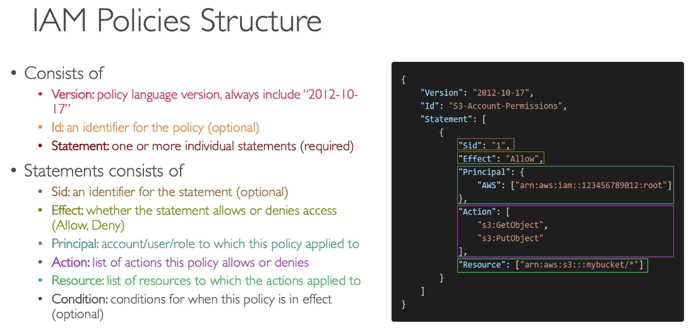
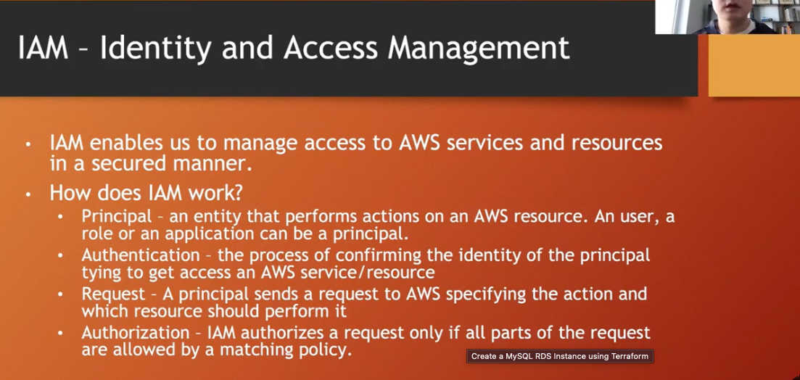

<h3 style='color:yellowgreen'>IAM Policies Structure </h3>

<h3 style='color:yellowgreen'>MFA Devices Options in AWS</h3>

- Virtual MFA devices
    - Google Authenticator ( phone Only )
    - Authy (Multi Device)
    - LastPass Authenticator
    - Microsoft Authenticator
    - Duo Mobile

 they have support multiple tokens on a single device. 
- Universal 2nd Factor (U2F) Security Key 
    - YubiKey by Yubico (3rd party)
 support for multiple root and IAM users using a single security key. 3
- Hardware Key Fob MFA Device 
    - Provided by Gemalto (3rd party)

- Hardware Key Fob MFA Device for AWS GovCloud(US)
    - Provided by SurePassID (3rd party)
if you are using a cloud of government in the the US.

<h3 style='color:yellowgreen'>IAM Security Tools</h3>

- IAM Credential Reports (account-level)
     a report that lists all your account's users and the status of their various credentials.

- IAM Access Advisor (user-level)
     access advisor shows the service permissions granted to a user and when those  services where last accessed.
     you can use this information to revise your policies

<h3 style='color:yellowgreen'>AWS account root user credentials and IAM user credentials</h3>
There are two different types of users in AWS. You are either the account owner (root user) or you are an AWS Identity and Access Management (IAM) user. The root user is created when the AWS account is created and IAM users are created by the root user or an IAM administrator for the account. All AWS users have security credentials.

- Root user credentials

        The credentials of the account owner allow full access to all resources in the account. You cannot use IAM policies to explicitly deny the root user access to resources. You can only use an AWS Organizations service control policy (SCP) to limit the permissions of the root user. Because of this, we recommend that you create an IAM user with administrator permissions to use for everyday AWS tasks and lock away the access keys for the root user.

        There are specific tasks that are restricted to the AWS account root user. For example, only the root user can close your account. If you need to perform a task that requires the root user, sign in to the AWS Management Console using the email address and password of the root user. For more information, see Tasks that require root user credentials.

- IAM credentials

        With IAM, you can securely control access to AWS services and resources for users in your AWS account. For example, if you require administrator-level permissions, you can create an IAM user, grant that user full access, and then use those credentials to interact with AWS. If you need to modify or revoke your permissions, you can delete or modify the policies that are associated with that IAM user.

        If you have multiple users that require access to your AWS account, you can create unique credentials for each user and define who has access to which resources. You don't need to share credentials. For example, you can create IAM users with read-only access to resources in your AWS account and distribute those credentials to users.

<h3 style='color:yellowgreen'>IAM Best practices</h3>

- Don't use the root account except for AWS account setup
- One Physical user = One AWS user
- Assign users to groups and assign permissions to groups level
- create a strong password policy 
- use and enforce the use of Multi Factor Authentication (MFA) 
- Create and use ROles for giving permissions toAWS services
- Use Access keys for Programmatic Access (CLI/SDK)
- Audit Permissions of your account with the IAM Credentials Report

<h3 style='color:yellowgreen'>IAM Identity and Access Management</h3>

<h3 style='color:yellowgreen'>IAM Components</h3>

there are 4 component in IAM
 - Users
 - Groups
 - Policies
 - Roles